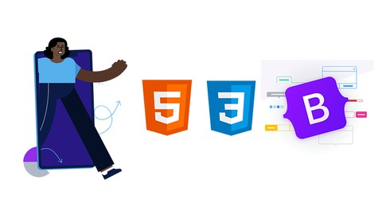

# Web-Design-Challenge {OpenWeatherAPI}

---

[Web-Design-Challenge](https://gabeo13.github.io/Web-Design-Challenge/) - Quick Link to GitHub Pages Site

---
## Background
This project utilizes GitHub Pages to present the vacation planning analysis performed with the OpenWeatherAPI and GooglePlacesAPI. A link to that portion of the project may be found [here.](https://github.com/gabeo13/python-api-challenge)

---
## Tools & Resources

> [GitHub Pages](https://pages.github.com/) : GitHub Pages is a static site hosting service that takes HTML, CSS, and JavaScript files straight from a repository on GitHub, optionally runs the files through a build process, and publishes a website.

> [VSCode](https://code.visualstudio.com/) : Visual Studio Code is a freeware source-code editor made by Microsoft for Windows, Linux and macOS. Features include support for debugging, syntax highlighting, intelligent code completion, snippets, code refactoring, and embedded Git.

> [Bootstrap v5.0](https://getbootstrap.com/docs/5.0/getting-started/introduction/) : Quickly design and customize responsive mobile-first sites with Bootstrap, the world’s most popular front-end open source toolkit, featuring Sass variables and mixins, responsive grid system, extensive prebuilt components, and powerful JavaScript plugins.

> [Bootswatch](https://bootswatch.com/) : A collection of themed swatches that you can download for free and drop into your Bootstrap site.

> [Flat UI Palette v1](https://flatuicolors.com/) : A collection of flat colors to use in CSS stylesheets.

 > [ionicons](https://ionicons.com/) : Premium designed icons for use in web, iOS, Android, and desktop apps. Support for SVG and web font. Completely open source, MIT licensed and built by [Ionic](https://ionic.io/?_gl=1*12hltcq*_ga*NjI1ODUzNjM1LjE2MTM2Njg3MTk.*_ga_REH9TJF6KF*MTYxNDYyMzUyMC41LjAuMTYxNDYyMzUyMC4w).

 ---
 ## Website Requirements

The website must consist of 7 pages total, including:

* A landing page containing:

    * An explanation of the project.
    * Links to each visualizations page. There should be a sidebar containing preview images of each plot, and clicking an image should take the user to that visualization.*

* Four visualization pages, each with:

    * A descriptive title and heading tag.
    * The plot/visualization itself for the selected comparison.
    * A paragraph describing the plot and its significance.

* A "Comparisons" page that:

    * Contains all of the visualizations on the same page so we can easily visually compare them.
    * Uses a Bootstrap grid for the visualizations.

        * The grid must be two visualizations across on screens medium and larger, and 1 across on extra-small and small screens.

* A "Data" page that:

    * Displays a responsive table containing the data used in the visualizations.

        * The table must be a bootstrap table component. Hint

        * The data must come from exporting the .csv file as HTML, or converting it to HTML. 

* The website must, at the top of every page, have a navigation menu that:

    * Has the name of the site on the left of the nav which allows users to return to the landing page from any page.
    * Contains a dropdown menu on the right of the navbar named "Plots" that provides a link to each individual visualization page.
    * Provides two more text links on the right: "Comparisons," which links to the comparisons page, and "Data," which links to the data page.
    * Is responsive (using media queries).

